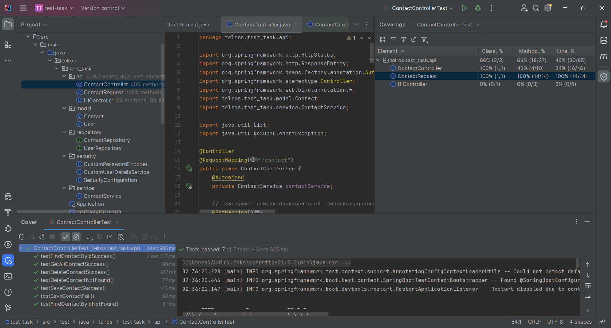

## REST-API для работы с базой данных информации о пользователях посредством Java и Spring

---

### Реализованные задачи:
* БД - PostgreSQL, поднята в Docker - контейнере, взаимодействие через Jdbs / Hibernate;
* Созданы сущности:
  * [Contact](https://github.com/MikhailAkulov/Test-Task-For-TR-Soft/blob/main/src/main/java/telros/test_task/model/Contact.java) - основная, с хранимой информацией о пользователе
  * [User](https://github.com/MikhailAkulov/Test-Task-For-TR-Soft/blob/main/src/main/java/telros/test_task/model/User.java) - для реализации авторизации
* [ContactService](https://github.com/MikhailAkulov/Test-Task-For-TR-Soft/blob/main/src/main/java/telros/test_task/service/ContactService.java)
  и [ContactController](https://github.com/MikhailAkulov/Test-Task-For-TR-Soft/blob/main/src/main/java/telros/test_task/api/ContactController.java), реализующие требуемый функционал CRUD;
* Авторизация, собственно настроена на странички [UIController'a](https://github.com/MikhailAkulov/Test-Task-For-TR-Soft/blob/main/src/main/java/telros/test_task/api/UIController.java)
  
  http://localhost:8080/ui - домашняя,

  http://localhost:8080/ui/contact - страничка с таблицей данных всех пользователей,

  http://localhost:8080/ui/contact/{id} - индивидуальные странички с данными пользователей,

  Ссылки кликабельные, немножко шаблонизатора Thymeleaf [resources/templates](https://github.com/MikhailAkulov/Test-Task-For-TR-Soft/tree/main/src/main/resources/templates);
* В папке [security](https://github.com/MikhailAkulov/Test-Task-For-TR-Soft/tree/main/src/main/java/telros/test_task/security) - всё, что касается сервиса авторизации;
* Файл [TestDataGenerator](https://github.com/MikhailAkulov/Test-Task-For-TR-Soft/blob/main/src/main/java/telros/test_task/TestDataGenerator.java) - создаёт admin'a, гордости не вызывает, но... что успел;
* покрыл [ContactController](https://github.com/MikhailAkulov/Test-Task-For-TR-Soft/blob/main/src/test/java/telros/test_task/api/ContactControllerTest.java)
  тестами.

---
### Запуск:
Точка входа: [Application](https://github.com/MikhailAkulov/Test-Task-For-TR-Soft/blob/main/src/main/java/telros/test_task/Application.java)

P.S.: Очень хотел произвести хорошее впечатление и как-то выделиться из толпы остальных кандидатов, поэтому изначально хотел выполнить задание с использованием `Vaadin` ([ссылка на репозиторий](https://github.com/MikhailAkulov/Test-Task-For-TR-Soft-Vaadin/tree/main)), к сожалению, времени потратил много, но успеха не добился и принялся навёрстывать упущенное. 